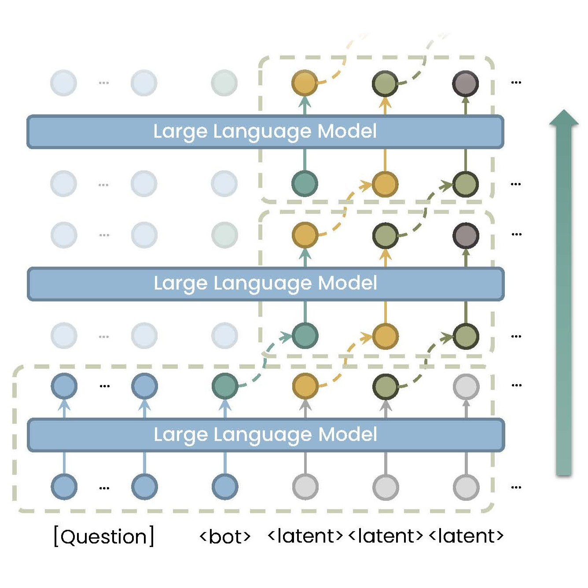

# PCCoT

<div align="center">

<p>
  By parallelizing the thought process
  <br>
  the training speeds up, the inference speeds up
  <br>
  and the performance rises up.
</p>
</div>

The code base for project **Parallel Continuous Chain-of-Thought**, parallelizing the continuous chain-of-thought approach with Jacobi iteration. It improves both training and inference efficiency of continuous chain-of-thought, with better performance on reasoning tasks. The paper "[Parallel Continuous Chain-of-Thought with Jacobi Iteration](https://arxiv.org/abs/2506.18582)" is under review.

## Installation

Change the cuda version if it is not compatible. Developped with python 3.12.4.

```bash
conda install pytorch=2.5.1 pytorch-cuda=12.1 -c pytorch -c nvidia
conda install mkl=2022.1.0
pip install https://github.com/Dao-AILab/flash-attention/releases/download/v2.7.4.post1/flash_attn-2.7.4.post1+cu12torch2.5cxx11abiFALSE-cp312-cp312-linux_x86_64.whl
pip install -r requirements.txt
```

The `transformers` package has a bug in the version we use. See [Trouble shooting](#trouble-shooting) for more details.

## Quick Start

We have released a finetuned GPT-2 model described in our paper on [HuggingFace](https://huggingface.co/whynlp/pccot-gpt2). To run this model, please first clone this repo then execute the following command:

```bash
python example.py
```

It provides an example usage of PCCoT model. See `example.py` for more details.

## Usage

Our implementation is based on HuggingFace `transformers`. We register new models `pccot-gpt2` and `pccot-llama` to facilitate the usage of PCCoT.

### Training

To train a PCCoT model, copy `run_ccot.sh.template` to `run_ccot.sh` and run it.

```bash
# for the first time execution
cp run_ccot.sh.template run_ccot.sh

# run the script
bash run_ccot.sh
```

It will finetune a GPT-2 model on the [GSM8K-AUG](https://huggingface.co/datasets/whynlp/gsm8k-aug) dataset. See the script for more details.

We use the same [training script](https://github.com/huggingface/transformers/blob/main/examples/pytorch/language-modeling/run_clm.py) as the original `transformers` library with slight modifications. You may refer to the [official documentation](https://huggingface.co/transformers/training.html) for more details.

To train a standard CoT model, use the `run_cot.sh.template` instead.

### Testing

The training script can also be used for testing and the metric will test the accuracy of the model generating every answer token correctly. In case you want to test the model with real generation result, use the `test_ccot.sh.template` script.

```bash
# for the first time execution
cp test_ccot.sh.template test_ccot.sh

# run the script
bash test_ccot.sh
```

It will test the model on the [GSM8K-AUG](https://huggingface.co/datasets/whynlp/gsm8k-aug) dataset. See the script for more details.

To test a standard CoT model, use the `test_cot.sh.template` instead.

### Configuration

We provide some sample configuration files in the  `configs` folder. The config settings are defined in [models/configuration_gpt2.py](models/configuration_gpt2.py). You may refer to this file for more details.

#### Option 1: Modify the configurations in python:

```python
from models import PCCoTGPT2Config

# we have prepared a sample configuration file
config = PCCoTGPT2Config.from_pretrained("configs/pccot_gpt2_small.json")

# setup the loss weights described in CODI
config.loss_alpha = 1
config.loss_beta = 1
config.loss_gamma = 1

# setup the number of iterations
config.num_iterations = 3
```

#### Option 2: Modify the configurations in the shell script (via `--config_overrides`):

```sh
accelerate launch run_ccot.py \
    --config_name configs/pccot_gpt2_small.json \
    --config_overrides loss_gamma=1,num_iterations=3 \
    ...
```

#### Other Arguments

There are also some other configurations defined in [models/pccot_arguments.py](models/pccot_arguments.py). You may refer to this file for more details.

To setup the arguments just write them in the shell script:

```sh
accelerate launch run_ccot.py \
    --num_latent_tokens 24 \
    --answer_prompt "The answer is:" \
    --lora_r 128 \
    ...
```

If you are loading a trained PCCoT model, then these arguments will by default be loaded from the checkpoint. If you want to override them, please remove the corresponding codes in the python script.


## Trouble Shooting

### Flash Attention

#### Behaviour
```
    query_layer, indices_q, cu_seqlens_q, max_seqlen_in_batch_q = unpad_input(query_layer, attention_mask)
    ^^^^^^^^^^^^^^^^^^^^^^^^^^^^^^^^^^^^^^^^^^^^^^^^^^^^^^^^^^^
ValueError: too many values to unpack (expected 4)
```

#### Solution
The transformers package has a bug in the version we use. Change it to
```
query_layer, indices_q, cu_seqlens_q, max_seqlen_in_batch_q, *_ = unpad_input(query_layer, attention_mask)
```

to fix this.
